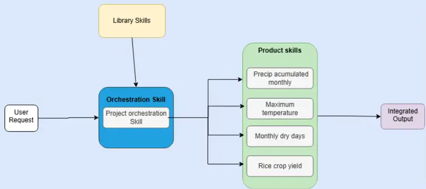

<!-- Technical blueprint deliverable. Keep this page the single source of truth
     for how the Hub is built; link to the wikis that go deeper rather than
     restating them here. -->

The Hub is a static site over a versioned metadata catalog, with the data itself
living in object storage and read directly by clients. This page describes each
layer and how they fit together.

## Architecture Overview

<!-- Drop the diagram here as an image reference, not inline SVG — Pandoc drops
     raw HTML on the way to PDF, so an inline <svg> would show on the site and
     vanish from the deliverable:
       
     Astro treats it as a collection asset; Quarto converts it for Typst. -->

## The metadata standard

### Introduction

A Hub record exists to make a resource discoverable, understandable without
opening the underlying files, citable, validatable against a schema, and usable
without manual interpretation — structured facts, not just free text. The CDH
metadata standard defines that record independent of any output format, then
maps it onto the community formats consumers already use: STAC for anything with
a spatial footprint, OGC API Records for everything else (documents, software,
services, non-spatial datasets). Records are authored once in CDH YAML; STAC or
OGC Records is what gets generated from it, not what a contributor writes by
hand. The standard is deliberately generic underneath the CGIAR-specific parts:
a project outside the Hub can adopt just the core schema, or compose its own
extensions on top, without inheriting any CDH policy. It is also explicitly
pre-1.0 — versioned and expected to change — so the model favors records that
stay valid as the standard evolves over one that is complete today and brittle
tomorrow.

### Methodology

The standard
([`cdh-metadata-standard`](https://github.com/CGIAR-Climate-Data-Hub/cdh-metadata-standard))
is a core JSON Schema plus a CDH profile that requires five CDH-maintained
extensions — `cdh`, `climate`, `datacube`, `classification`, `agriculture` — and
a native-fields-first authoring rule: put each fact in a core field before an
extension field, a linked sidecar asset, a custom extension, or free text, in
that order. Requirement levels (Required/Recommended/Conditional/Optional)
follow RFC 2119-style wording, and the schema rejects blank values outright.
Validation itself has two independent layers: a _mechanism_ check (core plus
exactly the extensions a record declares in `extensions[]` — fields from an
undeclared extension are rejected outright) and a _profile_ check (policy on
top, such as the CDH profile's requirement that every record carry the `cdh`
extension). That split is what lets an outside adopter reuse the mechanism
without adopting CGIAR's policy. The authoring guide keeps first drafts small on
purpose — `id`, `title`, `description`, `resource_type`, `cdh.domain`,
`keywords`, `license`, a `licensor` contact, `citation`, and `data` cover "can
someone find, understand, cite, and access this," with every other section
optional until it applies. Controlled vocabularies (`vocab/domain.json`,
`commodity.json`, `geography.json`) constrain the closed-vocabulary fields and
double as the scheme targets that `cdh.domain`, `commodities`, and linked
keywords get folded into as STAC Themes at encode time. `mapping-stac.md`
carries the same native-fields-first discipline into STAC: which STAC extensions
apply (Datacube, Table, Raster, Classification, Version, …), and explicit rules
for when a fact belongs on the Collection, an Item, a `summaries` entry, or an
Asset. The standard, its schemas, vocabularies, and extensions all share one
version tag; a release publishes schemas, vocab fragments, and extension
definitions to a versioned URL (`<tag>/schemas/…`) on the standard's own GitHub
Pages, plus an unversioned mirror of the vocabularies so `themes[].scheme` URIs
stay stable across releases. A record's `cdh_schema_version` names exactly the
tagged release it validates against, so a new standard release never invalidates
an existing record.

### Results

Records live in
[`cdh-catalog`](https://github.com/CGIAR-Climate-Data-Hub/cdh-catalog) as one
YAML file per resource — currently a small, real set (`glw4-2020`,
`mapspam2020`) rather than a placeholder schema with no data behind it. A
minimal record, once through the standard, looks like this:

```yaml
"$schema": https://cgiar-climate-data-hub.github.io/cdh-metadata-standard/v0.2.0/schemas/profiles/cdh.schema.json
cdh_schema_version: "v0.2.0"
id: chirps-daily-v1.0
title: CHIRPS Daily Precipitation
description: Daily gridded rainfall estimates blending satellite and station data.
resource_type: dataset
extensions:
  - https://cgiar-climate-data-hub.github.io/cdh-metadata-standard/v0.2.0/extensions/cdh/schema.json
keywords: [precipitation, gridded, daily]
license: CC-BY-4.0
contact:
  - organization: Climate Hazards Center
    roles: [licensor]
    url: https://www.chc.ucsb.edu/
citation:
  authors: [Funk, Chris]
  date: "2015"
cdh:
  domain: [climate]
data:
  - name: Daily rainfall, COG
    locations:
      - url: https://data.example.org/chirps/daily.tif
    media_type: image/tiff; application=geotiff; profile=cloud-optimized
```

`spatial`, `temporal`, `dimensions`, `variables`, and `classes` are added only
for the sections that apply to the resource — the real records in the catalog
use most of them. `glw4-2020` is a good illustration of the standard doing its
job: a `note` field carries the projection caveat that would otherwise mislead
anyone doing area-based analysis, `keywords` mixes plain search terms with a
linked AGROVOC concept, and `contact` entries carry distinct `roles`
(`licensor`, `producer`, `processor`, `point-of-contact`) rather than one
undifferentiated author list. Getting a record published runs through a gate,
not a merge: a submission opens a pull request — either a contributor editing
YAML directly, or the same PR produced on their behalf by
[`CDH-metadata-app`](https://github.com/CGIAR-Climate-Data-Hub/CDH-metadata-app),
a lightweight guided front-end that calls the same GitHub Action rather than
writing files itself. `cdh-metadata-standard`'s reusable validation workflow
runs automatically against every PR, and `CODEOWNERS` requires sign-off from a
named owner before it can merge. On merge, a second full-set validation runs
before the catalog is allowed to notify the site (below) — so a rule change or a
bad rebase can't silently ship an invalid record. Converting a validated record
to STAC or OGC API Records is the job of
[`cdh-metadata-tools`](https://github.com/CGIAR-Climate-Data-Hub/cdh-metadata-tools),
a pygeometa-style CLI: `io.py` reads the raw authoring YAML, `model.py` parses
it into a lenient typed `CDHRecord` (unknown and forward-compatible fields
survive the round trip; validation of completeness is left to the JSON Schema,
not the model), and a small registry of pluggable output schemas
(`STACOutputSchema`, `OGCRecordsOutputSchema`) encodes that typed record into
the target format — `metadata-tools generate --schema stac`. A `datapackage`
(frictionless) output schema is scoped but not yet built. The tool isn't wired
into `cdh-catalog`'s CI yet — today it runs standalone — but it is where the
CDH-to-STAC mapping is implemented in code rather than only specified in docs.

### Publishing and discovery

Two different things get published here, on two different schedules. The
standard itself — schemas, vocabularies, extensions — publishes to versioned
URLs on `cdh-metadata-standard`'s own GitHub Pages whenever a release is tagged,
gated on `npm run check` passing so a broken schema graph never goes live.
Individual records publish far more often: a merge to `cdh-catalog`'s `main`
branch is what feeds the [build pipeline](#build-pipeline) — once the second
validation pass clears, a `repository_dispatch` tells the site to rebuild and
fetch the updated records. See that section for what happens from there.

## Data storage and distribution

<!-- Object storage, the cloud-native formats (COG, Zarr, Parquet) and why
     each is used, subsetting/streaming instead of bulk download. -->

## Build pipeline

<!-- records repo → build-time fetch → static output; the repository_dispatch
     rebuild trigger; where the skills collection comes in. -->

## The site layer

### Introduction

The Hub needed a public-facing site to present datasets, documentation, and
machine interfaces without operating a server or database. Astro was chosen for
its simplicity in building documentation-style sites: pages are static by
default, content is authored in Markdown/MDX, and the framework ships zero
JavaScript unless a component opts in. This keeps pages fast and readable by
anything that fetches them, human or machine.

### Methodology

The site runs on Astro's content collections (`src/content.config.ts`): typed,
schema-validated content for tutorials, wikis, FAQ, use cases, and contribution
guides. Two collections — `catalog` and `skills` — are fetched from their source
repos (`cdh-catalog`, `skills`) at build time rather than stored locally, via
custom loaders (`src/lib/records.ts`, `src/lib/skills.ts`), so each piece of
metadata keeps one home. Markdown renders through Astro's Sätteri pipeline with
heading-anchor and Shiki syntax-highlighting plugins (`astro.config.mjs`);
search is client-side via `astro-pagefind`, and `@astrojs/sitemap` generates the
sitemap. Biome enforces one lint/format standard across the codebase, and Bun is
the package manager.

### Results

The build produces the full public site — catalog, tutorials, wikis, FAQ, and
use-case pages — plus the machine-interface surface (`/ai/`,
`.well-known/agent-skills/`, `.well-known/api-catalog`, `llms.txt`,
`robots.txt`) described under [Machine interfaces](#machine-interfaces). Every
collection's schema is validated at build time, so malformed content fails the
build rather than reaching production.

### Publishing and discovery

`astroDeploy.yml` builds and deploys to GitHub Pages on every push to `main`, on
manual dispatch, and on a `repository_dispatch` fired by `cdh-catalog` when
records change — so a metadata update rebuilds the site without a manual
release. A `REQUIRE_RECORDS` guard stops a zero-record build from deploying over
a working catalog. The site is served at the GitHub Pages root under the
canonical domain hardcoded in `astro.config.mjs`; moving to a custom domain
later is a one-line change plus a `public/CNAME` file.

## Machine interfaces

### Introduction

Every page on the Hub is built for two readers at once: a person in a browser
and an agent that needs the same information without parsing HTML. Rather than
stand up a separate API and keep it in sync with the site, the Hub gives each
page a machine counterpart at a predictable URL, generated from the same content
collections at build time. There is nothing to fall out of date, because there
is nothing hand-maintained to forget — the machine surface and the human surface
come from one source.

### Methodology

Each interface targets a different consumption pattern. A page's markdown source
is served as a plain-text twin at `<page>/index.md` (`src/pages/[...page].ts`)
for agents that would rather read Markdown than strip HTML; MDX pages and
notebooks are excluded because their source bodies can carry JSX or base64
figures that aren't plain markdown. `llms.txt` and `llms-full.txt` give a
compact and a fully-inlined map of the whole site, regenerated from the
collections on every build rather than written by hand. `catalog.json` publishes
the entire catalog as one schema.org `DataCatalog` document — the same markup
Google Dataset Search reads — with each record's full CDH metadata also standing
alone at `/catalog/<id>.json`. Discovery itself is machine-readable too:
`/.well-known/api-catalog` advertises the Hub's endpoints as an RFC 9727
linkset, and `robots.txt` sets Content Signals
(`search=yes, ai-input=yes, ai-train=yes`) to state AI use is welcome rather
than leaving it ambiguous. Pages also register in-browser WebMCP tools
(`src/lib/webmcp.ts`) — search the catalog, fetch a record, list skills — so an
agent already sitting in an open tab can act without leaving it.

### Results

A static host on GitHub Pages can't do everything this posture would ideally
want: no content negotiation (serving JSON or Markdown from the same URL based
on an `Accept` header) and no custom response headers, so there's no HTTP `Link`
header pointing an agent at `/.well-known/api-catalog`. The repo carries what
that would look like anyway — `public/_headers` declares the `Link` header and a
corrected linkset `Content-Type`, with its own comment noting the limit:
`Cloudflare Pages only; GitHub Pages serves this as a
plain file.` Everything
the Hub can guarantee on GitHub Pages instead moves into the URL space itself —
a separate path per format, discovery files at well-known locations — so a real
host gains header-level shortcuts later without anything else changing.

### Publishing and discovery

The full, current list of endpoints — with descriptions of what each returns and
why — is published at [`/ai/`](/ai/) rather than duplicated here; that page also
lists the installable agent skills described under
[Agent skills](#agent-skills). Treat `/ai/` as the source of truth for the
endpoint table and this section as the reasoning behind it.

## Agent skills

### Introduction

Across the institutions that make up CGIAR, researchers spend much of their time
on the same kinds of tasks: downloading datasets, defining methodologies,
running analytical protocols, and assembling information for their studies. In
practice, each center tends to rebuild these processes on its own — the same
workflow reinvented in a dozen places, with little that can be handed off or
reused across institutions. The aim of this work is to change that: to capture
each process once, in a form that is reproducible and easy to share, so that
both the data and the methods behind it can be picked up and reused by another
institution with as little friction as possible.

#### Simplifying geospatial processing

The Hub's datasets are cloud-native and machine-readable, yet turning them into
a usable result still demands knowledge that most researchers don't carry day to
day: which source holds which variable, how to clip a raster to an
administrative boundary, which aggregation method preserves the correct units,
how to compute a seasonal indicator over a spatial grid, and what fields the CDH
metadata schema requires.

#### Standardizing workflows via AI Agent Skills

The agent-skills work set out to close that gap — to let a researcher state what
they need in plain language and have an AI agent carry out the full workflow
correctly, from raw download to a shareable output.

A skill is a set of instructions that tells an agent how to accomplish a
specific goal: what to ask the user, in what order to perform each step, and
what a correct result looks like. Its purpose is standardization. Instead of
every conversation reinventing how a task is done, the same procedure runs the
same way each time — regardless of who is asking or which agent is executing it.

In practice, each skill is a plain-text SKILL.md file: YAML frontmatter that
tells the agent when to trigger the skill, followed by Markdown instructions
describing the workflow. Optional folders can bundle helper scripts, reference
documents, and templates alongside it.

#### Why AI Agent Skills?

We considered other ways to deliver these workflows. A bespoke chatbot would
need its own server, authentication stack, and ongoing maintenance, and would be
tied to a single AI provider. A custom API wrapper would remove some of that
burden but would still leave the user writing code to call it. Agent skills take
a different approach. Because a skill is just an open-format text file, any
compatible assistant can load and follow it — Claude Code, OpenAI Codex, and
Antigravity all read the same skill folder. Each workflow is therefore published
once and works everywhere, with no server to operate and no vendor lock-in.

#### Supporting Multi-Modal execution personas

The workflows were designed with two kinds of users in mind. The first is
comfortable with programming and with AI agents, and wants direct, scriptable
control; the second needs to reach a result quickly using only plain-language
prompts, without touching code. For the first profile, we documented use through
the terminal with Claude Code. For the second, we relied on more guided,
GUI-driven agents such as Antigravity or Codex. In every case the end-user
experience is the same: describe what you need in one sentence, confirm the
proposed plan, and receive a ready to use output.

### Methodology

#### Skills creation

Each skill was built and iterated using Anthropic's
[skill-creator](https://github.com/anthropics/skills) — an open meta-skill that
interviews you about the task, drafts a `SKILL.md`, proposes test prompts, runs
them in parallel (with skill enabled vs. without), and shows outputs
side-by-side with pass rates. The loop is: describe the task → review the draft
→ run evals → leave feedback → skill-creator rewrites and re-runs — until pass
rates are satisfactory. This process keeps skill writing grounded in observed
agent behavior rather than intuition about what instructions should work.

#### Repository structure

Skills live in the `.agents/skills/` folder of the skills repository, one
subfolder per skill, each holding a required `SKILL.md` plus whatever
`references/`, `evals/`, or `assets/` that skill needs:

```
skills/
├── skills.json                    # index: skill name → SKILL.md path
├── skills-lock.json               # content hash per skill, checked before install/update
├── .agents/
│   ├── AGENTS.md                  # repo-level agent instructions
│   ├── mcp_config.json
│   └── skills/
│       ├── climate-data-download/
│       │   ├── SKILL.md
│       │   └── references/
```

Every skill folder is self-contained and independently loadable — an agent only
needs the one subfolder its plan resolves to, not the whole repo — which is what
lets a foundational skill be updated without touching the orchestrators that
call it.

#### Underlying Python packages

Most foundational skills are conversational wrappers around two Python packages
— [`aggeodata`](https://github.com/CGIAR-Climate-Data-Hub/aggeodata) for data
acquisition and
[`ag-cube-cm`](https://github.com/CGIAR-Climate-Data-Hub/ag-cube-cm) for crop
model orchestration — described in [Python packages](#python-packages) below. A
skill's job is to collect parameters, confirm a plan, and hand off to the
package; the package does the actual download, processing, or simulation.

#### Design pattern: foundational skills + orchestrators

The work was decomposed into single-responsibility _foundational skills_, each
owning one well-defined task. _Orchestrator skills_ sit on top: they collect
parameters, confirm a plan with the researcher, then delegate each stage to the
relevant foundational skill rather than re-implementing it. Any foundational
skill can therefore be used alone or updated without touching the orchestrators.



### Results

#### Scoping

These are the skills that were developed to be used across different use cases;
the idea is that when multiple projects share similar activities, those
processes can be standardized into common steps.

This is an initial set that will expand following CGIAR project requirements.

The foundational skills developed so far are:

**Data acquisition**

| Skill                   | What it does                                                                                                                                                |
| ----------------------- | ----------------------------------------------------------------------------------------------------------------------------------------------------------- |
| `climate-data-download` | Routes each variable to its authoritative source (CHIRPS, CHIRTS-ERA5, NASA POWER, AgERA5), shows a plan, and fetches in sequence                           |
| `soil-data-download`    | Downloads SoilGrids global soil property rasters (clay, sand, silt, bulk density, organic carbon, pH) and stacks them into a validated NetCDF soil datacube |

**Spatial processing and visualization**

| Skill                       | What it does                                                                                                                                           |
| --------------------------- | ------------------------------------------------------------------------------------------------------------------------------------------------------ |
| `geospatial-cube-processor` | Clips rasters to admin boundaries (GADM), stacks multi-source datasets onto a common grid, computes zonal statistics, exports Cloud Optimized GeoTIFFs |
| `notebook-plots`            | Inserts interactive Plotly chart cells into an existing Jupyter notebook; exports a standalone Plotly HTML file alongside it                           |
| `climate-dashboard`         | Builds a self-contained Chart.js HTML dashboard — KPI cards, filters, sortable table — that opens in any browser with no server                        |
| `sciplot-skill`             | Generates publication-ready matplotlib figures meeting the typography and resolution standards of high-impact journals (Nature, Science, Cell)         |

**Hub utilities**

| Skill          | What it does                                                                                                                                                   |
| -------------- | -------------------------------------------------------------------------------------------------------------------------------------------------------------- |
| `cdh-metadata` | Inspects a geospatial dataset, asks for fields it cannot derive automatically, and writes a valid CDH YAML metadata record ready for submission to the catalog |

So far, only two use cases have been considered: GCF and AgWISE. These skills
are likely to be reused across other projects too, since climate information is
required well beyond either of them — that reuse is the whole point of building
foundational skills.

#### Use cases

##### GCF climate data access

Green Climate Fund (GCF) proposals need a defensible climate rationale —
grounded in subnational climate and agricultural data — to justify the case for
funding. Producing that evidence today is slow and manual: sourcing the right
variables per country, clipping them to the right boundary, and assembling the
tables a Concept Note or Funding Proposal expects. The `gcf-pipeline`
orchestrator automates that data-gathering step, so a proposal writer states
what they need and gets back ready-to-use tables, rasters, and figures instead
of raw downloads.

The `gcf-pipeline` orchestrator enforces six explicit gates, so no stage runs
before the researcher has approved the plan:

1. **Collect parameters** — country, variables, date range, output folder, admin
   level, aggregation method, temporal frequency
2. **Confirm plan** — the agent shows exactly what will be downloaded and how it
   will be processed; nothing moves until the researcher approves
3. **Download** — delegates to `climate-data-download`, which fetches the
   required NetCDF files
4. **Process** — delegates to `geospatial-cube-processor`, which clips,
   aggregates, and exports a CSV and COG per variable
5. **Visualize** — delegates to `notebook-plots` and `climate-dashboard` in
   parallel; both outputs are produced by default
6. **Summary** — lists every output path and its size

The confirmation gate at step 2 is the most important: it surfaces mis-routing
(wrong variable, wrong boundary level) before a long download begins rather than
after.

##### AgWise spatial crop modeling

AgWise is a CGIAR framework that turns field-trial, market, topography, climate,
and soil data into tailored agronomic recommendations — fertilizer rates,
planting dates, cultivar choice — for partners across Africa. Its fertilization
module depends on process-based crop model simulations, which need
high-resolution climate and soil data run pixel-by-pixel across a region. The
`spatial-crop-modeler` orchestrator closes that gap, driving the `aggeodata` and
`ag-cube-cm` packages end-to-end so the fertilization module always has current,
validated yield inputs.

The `spatial-crop-modeler` orchestrator runs DSSAT pixel-by-pixel over a spatial
domain, combining climate and soil datacubes into a yield map. Its first design
decision is a mode question: whether the datacubes already exist on disk
(`with_cubes`) or need to be downloaded and assembled first (`full_pipeline`).
Skipping unnecessary downloads when the user already has the data is the main
reason the mode exists — the simulation itself is identical in both cases.

Before collecting any parameters the skill runs a silent environment check,
verifying that `ag-cube-cm`, `aggeodata`, and `mcp` are all importable. If any
are missing it stops and shows the exact install command. This prevents the
common failure of reaching step 5 only to discover the simulation tool was never
installed.

The eight gates in `full_pipeline` mode:

1. **Environment check** — silently verifies `ag-cube-cm`, `aggeodata`, and
   `mcp` are installed; stops with the install command if any are missing
2. **Collect parameters** — bounding box, date range, crop name, cultivar code,
   planting date, output directory; for `full_pipeline` also climate sources and
   a suffix label for file naming
3. **Confirm plan** — shows mode, area, period, climate and soil sources, crop,
   planting date, and output path in a single table; no files are written until
   the researcher approves
4. **Generate YAML config** — writes the `ag-cube-cm` config file; flags any
   `working_path` that contains spaces (DSSAT is a Fortran program that fails
   silently on space-containing paths)
5. **Validate config** — runs `ag-cube-cm validate` and resolves any errors
   before touching data
6. **Run simulation** — runs `ag-cube-cm run`; for `full_pipeline` this
   downloads climate via `climate-data-download`, builds the weather datacube,
   delegates soil download to `soil-data-download`, then runs DSSAT across every
   pixel; intermediate files are cached so re-runs skip completed steps
7. **Quality gate** — mandatory before any visualization; checks three
   thresholds: at least 20 % of pixels succeeded (`flag=0`), fewer than 50 %
   failed (`flag=1`), and mean harvest yield (`HWAM`) above 200 kg/ha; a clean
   exit code from DSSAT is not a quality signal — the gate exists because
   `ag-cube-cm` exits cleanly even when the entire domain is over water or the
   planting season is wrong; if any threshold fails the skill halts, surfaces
   the pixel summary, and diagnoses before proceeding
8. **Visualize** — only after the quality gate passes; delegates to
   `notebook-plots` and `climate-dashboard` for the yield map and summary
   figures

The quality gate at step 7 is the sharpest difference from the GCF pipeline.
Because DSSAT's exit code does not distinguish a successful run from a run that
produced no valid output, a mandatory programmatic check is the only reliable
way to stop a researcher from presenting an all-NaN yield map as results.

#### How to use these skills

Which interface fits depends on the persona described in the introduction — the
workflow underneath is identical either way; only the surface changes.

**Technical users** run skills directly from a terminal-based agent (Claude
Code, OpenAI Codex) with the skills repository already configured. A single
natural-language request is enough; the agent resolves it to a skill, confirms a
plan, and executes:

```
You:   Simulate maize yield potential in Mwanza district, Malawi, 2010–2012,
       planting 2010-11-01, 4 windows, no fertilizer, 8 cores.

Agent: [resolves the request to spatial-crop-modeler]
       → checks ag-cube-cm and aggeodata are installed
       → shows the plan — area, period, crop, sources — for approval
       → runs the pipeline, reports mean yield and output paths
```

**Non-technical users** — proposal writers, partners, anyone without a
development environment set up — go through a GUI-based agent (Antigravity) that
follows the same `SKILL.md` workflow with no command line involved. The prompt
is just as plain; there's no terminal, no install step, no code to read:

```
You:   I need rainfall and temperature data for Togo, 2015–2023, by
       district, for a GCF proposal.

Agent: [resolves the request to gcf-pipeline]
       → shows the same plan a terminal user would see, in the chat window
       → delivers a CSV, a COG per variable, and a dashboard link
```

Both routes run the same skill and produce the same output — only how the plan
is confirmed and the result is handed back changes. See
[Publishing and discovery](#publishing-and-discovery) below for how each
interface is installed.

### Publishing and discovery

Skills live in
[github.com/CGIAR-Climate-Data-Hub/skills](https://github.com/CGIAR-Climate-Data-Hub/skills),
separate from the site source. The Hub fetches them at build time via the
`skills()` Astro loader (`src/lib/skills.ts`), using the same mechanism as the
catalog fetch from `cdh-catalog`. A `skills.json` index at the repo root maps
each skill name to its `SKILL.md` path; agents resolve that index and verify the
content hash recorded in their local `skills-lock.json` before installing or
updating, so researchers always run the version they checked.

The repository also ships deployment guides for Antigravity and OpenAI Codex
alongside the Claude Code guide, so the full pipeline is accessible to
researchers who do not have a paid Claude subscription.

## Python packages

Two open-source Python packages do the heavy lifting behind the foundational
skills — each skill is a thin conversational wrapper around one of them, and
both can be used directly, without an AI agent, by anyone comfortable scripting
the workflow.

### aggeodata

[`aggeodata`](https://github.com/CGIAR-Climate-Data-Hub/aggeodata) handles data
acquisition: it downloads daily gridded climate data from CHIRPS, CHIRTS,
AgERA5, and NASA POWER, and static soil properties from SoilGrids, then
assembles them into analysis-ready NetCDF datacubes aligned to a common grid and
CRS. A YAML-driven pipeline (`run_download` → `run_datacube`) covers the common
case; each source also has a standalone downloader for one-off use.

### ag-cube-cm

[`ag-cube-cm`](https://github.com/CGIAR-Climate-Data-Hub/ag-cube-cm) is the
crop-modeling layer: it takes the datacubes `aggeodata` builds and runs a
process-based crop model — DSSAT, CAF2021, SIMPLE, or the pure-Python Banana-N
model — pixel-by-pixel across the domain in parallel, producing a gridded yield
map (kg/ha) across planting windows, years, and space. It performs no downloads
of its own. Both packages ship an MCP server, so an AI agent can drive the same
two-step workflow the `spatial-crop-modeler` skill uses.

## Versioning

<!-- Field-based versioning: version, previous_version, deprecated — and why
     folder layout is never used to infer a version. -->

## Repositories

<!-- What lives where across the GitHub org, so a reader can find the source
     for any layer above. -->
